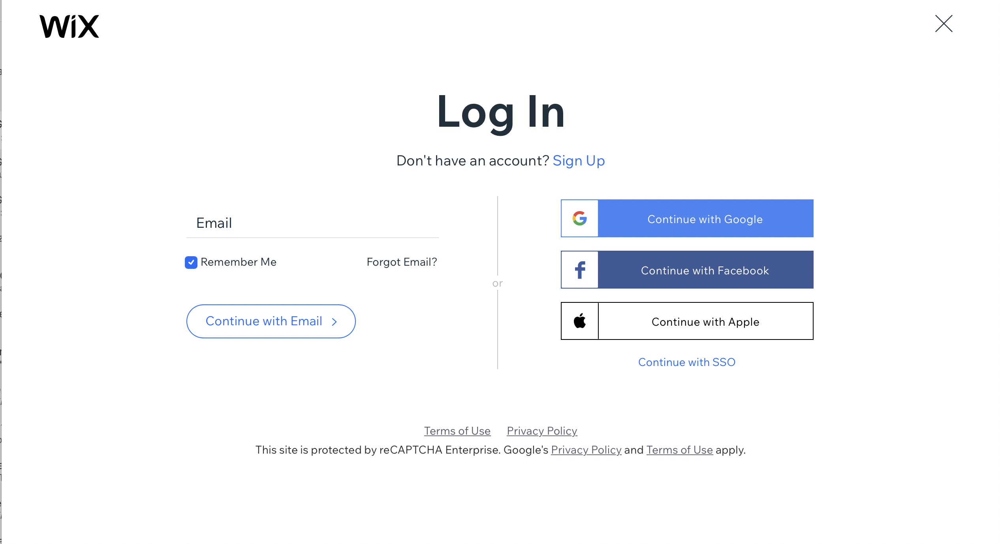
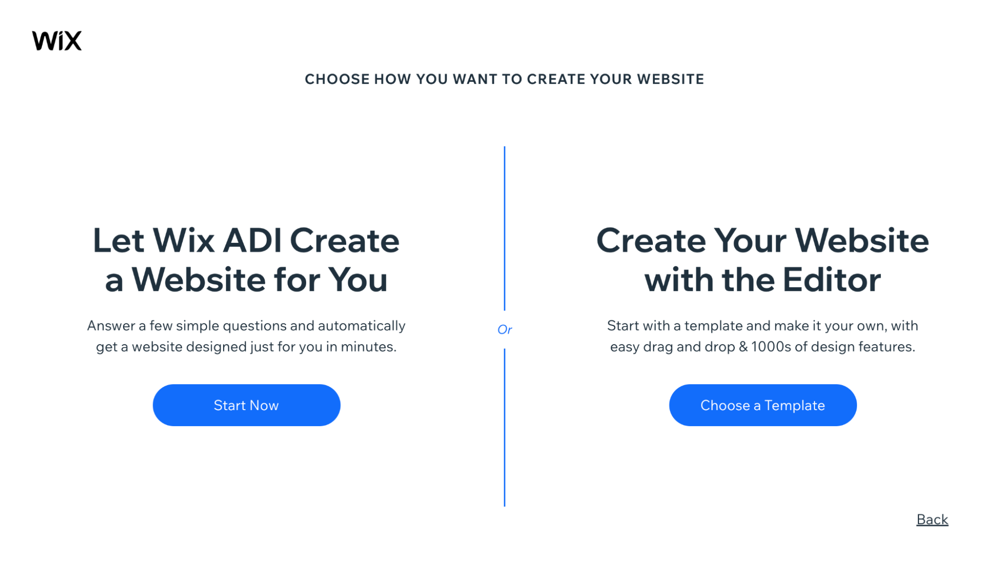

# simple-wix-website
 Wix is a free and user-friendly website building platform that comes packed with some powerful built-in features.
 If you are looking to build a website from scratch, the Wix Editor is a great option.

## **1. What You Need to Know About Wix**
**[Wix](https://wix.com)** is an all-time favorite 🥰 because it has an intuitive technology, drag-and-drop editor, and hundreds of attractive and functional templates. From blogs to business websites to ecommerce stores, Wix can do it all and do it well.

## 2. 6 Steps to Use WIX
Finally, to the fun part! 😁
### **Step 1 — Create An Account With Wix**

- Go to www.wix.com
- Click on Get Started. 

- Enter your email address to create your account. You can also choose to sign up with **Google**

You’ll have to answer a few short questions about your new website before the sign-up is complete.

### **Step 2 — Select How To Create Your Website**
Next, you’ll have to decide if you want to create a website within the Wix Editor or let the Wix ADI tool design one for you.

### **Here a brief overview of what you’ll see in the editor:**

**Elements:** You can click on an element to customize it, plus where you can change the images, write text, add buttons, and more.

**Add a Page:** Go to Pages, and click on Add Page from the top menu bar. You’ll see a host of new page types and premade page templates. Select the one you like.

**Design:** To change your website themes and layout or alter colors, fonts, and other elements, click on Design in the top menu bar.

### **Step 3 — Select a Wix Template**
First, you have to pick the website template based on the type of site you want. 

You can filter the templates by category and view every template in demo mode to see what it looks like. Once you find a template you like that also fits your project, click **Edit**.

### **Step 4 — Customize Your Website**
After you select a template, you can customize it on the Wix Editor using its drag-and-drop facility.

Click on any element on the page to alter its settings, reposition, or resize. You can also change colors, rewrite text, add images, and more. Anything you want, really. Any changes you make will appear in real-time, so you know exactly how your website looks to visitors.

The top menu bar is your one-stop destination to find some important Wix Editor features to customize your website. 

**Page** – This lets you toggle between your website pages and your blog.

**Desktop/Mobile** – Use this to switch between desktop and mobile mode. It’ll be useful to edit your site for both devices.

**Settings** – This is the place to be if you want to add a favicon, view site analytics, or simply make some tweaks.

**Save/Preview/Publish** – You must always make a point to save your website as you go. Additionally, you can use this to preview your site on the front and publish it when you’re ready.

### **Step 5 — Download Wix Apps to Improve Functionality**
As mentioned previously, Wix has an innovative App Marketplace where you can download free and premium applications to boost your website‘s functionality.

To assess the marketplace, click on the Add Apps option from the left-hand side and then browse through the market to find options that interest you.

### **Step 6 — Publish Your Brand New Wix Website**

At this stage, everything is done. You now have a website that not only looks great but also performs well. The last step is to publish it. 

Select Publish on the top right-hand corner of your screen. Ta-Da! Your website is now live.

## AUTHOR
Alberta Cofie